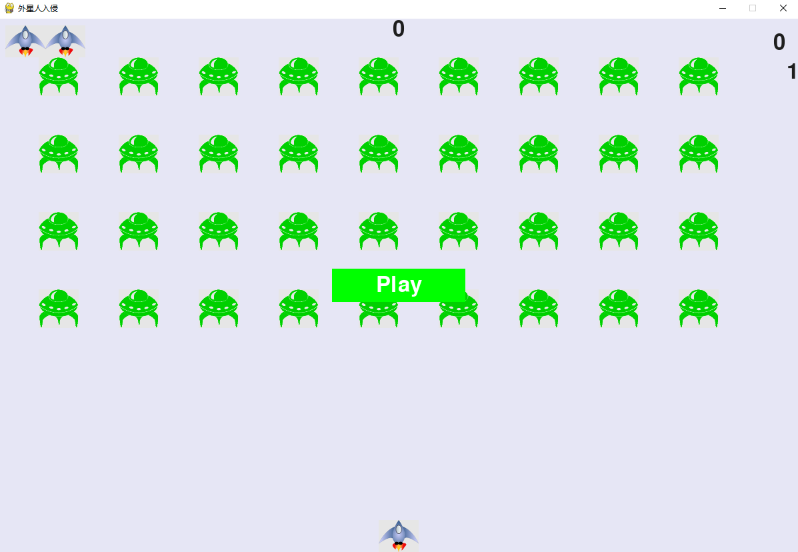
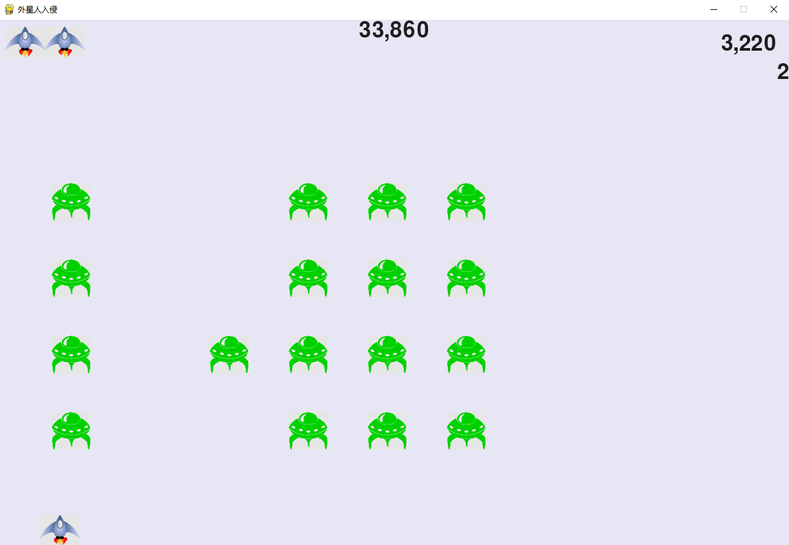

## 寫在前面
在codewar上寫了那麽多函數題目，class相關的也掌握了，但是綜合能力不太行，比方説一個模塊裏某個函數總是不知不覺寫得很長。
功能雖説很多，但其實更深層次的原因是不敢優化，害怕引入新錯誤。
但這一関是一定要過的。

我將做書上的那個飛船游戲，使用pygame跟著教程一步步走，在這個過程中復習之前的知識，尤其是提高自己管理這種多文件的項目的能力。
除此之外，寫一個游戲可以自娛自樂，也可以讓別人快樂，看到一個游戲不是祇想著玩，還可以想想別人是怎麽實現的。

## 規劃項目
先要把大方向抓住，即要幹什麽，可能需要的工具、可能遇到的困難。
游戲如果能做得出來，大概是這樣的：玩家控制一個屏幕下方的3組飛船移動，按space射擊，子彈攻擊自上而下降落的一批批越來越强的外星人后勝利。如果外星人碰到飛船或者到了屏幕底部，則飛船-1，儅-3時玩家敗北！

**需要的東西**：*python、pygame*庫

**流程**：先寫飛船class、再寫外星人class、最後弄積分系統...

## 開發過程
在Pagetest這個環境下直接`pip install pygame`

首先弄個run_game游戲窗口函數，一頓寫弄出來一個灰色小屏幕，然後總不能讓這些設置語句、參數等七零八落的，後面代碼量起來后不好管理，所以索性新建模塊、封裝一個set類，這一步高明！（後面可以回過頭來想想這裏如果不弄set類，而是頭痛醫頭脚痛醫脚，會怎麽樣）

繪製飛船用位圖，在[課程網站](https://www.nostarch.com/pythoncrashcourse/)

要注意的是，繪製飛船説白了就是將一個圖片的surface對象顯示在屏幕的某個位置，用blit函數

每次先畫背景再ship后更新，否則看不到船。

有遠見的人這時候已經感覺到，這樣下去alien_invasion會很長，一長且不説邏輯不好理解，就是找一個函數也不容易，於是再弄個gamefunction來分擔壓力，這一步的風格正是我當前所需要的。

經過一頓操作，讓程序只有兩行，而且各種模塊各司其職，維護起來也有的放矢，果然厲害！這要是放以前，我肯定以爲本來兩三行代碼的事情幹嘛如此大動干戈？看來以前自己畢竟沒有遇過大項目，還是太嫩！
現在用這種眼光來看github上的項目代碼，主函數都是寥寥幾行，也有很多模塊，這些作者看來是學到了精髓的！

所謂精髓就是：**一開始將代碼寫得盡可能簡單，儅項目逐漸變得複雜時候，進行重構，從而更容易擴展。然後考慮動態方面！**
<del>(我真的很喜歡這種循規蹈矩的處理方式哎！)</del>

關於飛船移動，一開始在event中用鍵盤按下監聽，發現按一下動一下效率低，於是只要按著flag為true飛船持續移動，但是這個功能寫在event中還是ship中呢？

day2：

如果不單獨弄個存小數的，飛船向右比向左飛得快，而且不夠絲滑。問就是前人經驗。

關於子彈，繼承自sprite，可將元素編組，整體操作。子彈并不是基於圖像，所以定義一個rect來存放信息，本來是0，0，高寬，緊接著立馬調整坐標，難道這個代碼運行子彈不會跳變嗎？還是説顯示是等這些都弄好了才開始？

**關於外星人part**

先生成一個外星人，再生成一群。這裏主要的是外星人對象與子彈對象、飛船對象之間的碰撞事件，每次都要想想引入外星人時候原來的代碼需不需重構，同時對之前混亂或低效的代碼進行清理。

*小trick*：結束游戲時候每次要鼠標點一下，乾脆換成按鍵吧~(要是退不出去，先shift一下再q)

總之，不要害怕現在函數的代碼太少，我只害怕太長。後面要加東西，要引入功能，太長的話會越來越不想寫。另外，現在隨便改一下setting裏的參數都能有很多有趣的情況，要是都雜糅在一個函數中，恐怕面對那麽多的if-else，根本不敢亂動吧？

*關於ship碰撞后的歸位問題：* 
本來碰撞后`self.rect.center = self.screen_rect.centerx`即可，但是我想`self.rect.centerx = self.screen_rect.centerx`應該也行吧？試了一下發現不行，爲了發現問題進行debug，發現中斷后centerx為600，center是157，沒錯！然後對ship重新初始化時候發現先要將center賦值給centerx，所以問題解決。花了我半小時（不過我覺得很值）

*關於結束后出現play，點擊后沒反應的問題：* 
其實點擊后確實變成了true了的，但是飛船數還是0，所以一走循環體給它們初始化又回到了False。所以要加個重置相關的東西。

## 運行結果

完結撒花！！！😄可以去看天才簡史了。😄

